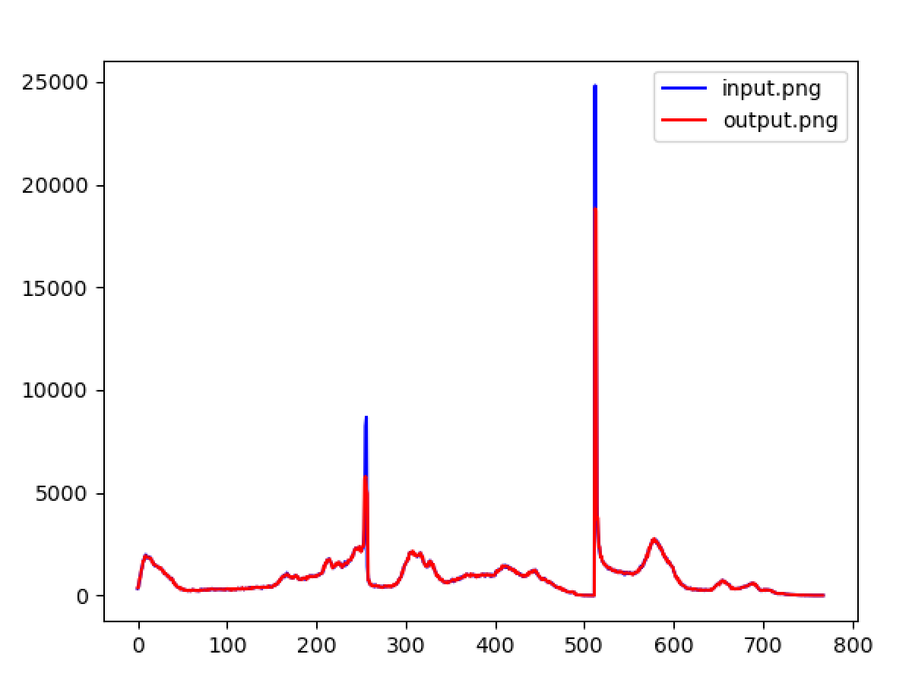
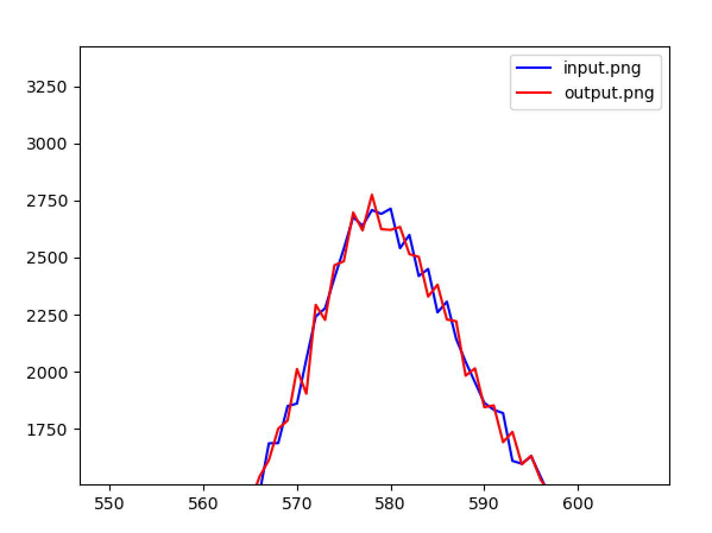

# shikomizue
Steganographic binaries

shikomizue: a command-line stegware tool for antivirus evasion. shikomizue allows users to conceal an executable binary in an arbitrary .png image file. The binary is decomposed into a bitstream and extended in such a manner as to balance the net number of 1s and 0s (which helps prevent detection via the RGB histogram.) Successive bits are used to overwrite the least significant bits (LSBs) in a reproducible pseudorandom sequence of pixel RGB values, determined by a seed. A smoothing function ensures that 1s and 0s are roughly proportionate in the bitstream, which results in fewer obvious changes to the RGB histogram of the steganographic output image. Following transport of the steganographic image file to the target LINUX machine, the binary is extracted and executed in memory, without touching the file system. This tool also features an option (-g switch) to output superimposed RGB histograms of the original and modified (output) images.

To create a steganographic image file, run the main script with the -c switch and appropriate options:

>./shikomizue.py -c -i <input_image.png> -s <random_seed> -o <output_image.png> -p <executable_payload>

So, for example:

>./shikomizue.py -c -i input.png -s oogabooga -o output.png -p xeyes

The -g switch may be used to display superimposed RGB histograms of the input and output images:
>./shikomizue.py -c -i <input_image.png> -s <random_seed> -o <output_image.png> -p <executable_payload> -g

For the -g switch to work, histogram.py must be installed in the same directory
  

Finally, the executable payload can be extracted and executed in memory with the -d switch:
>./shikomizue.py -d -i <steg_image.png> -s <random_seed>
